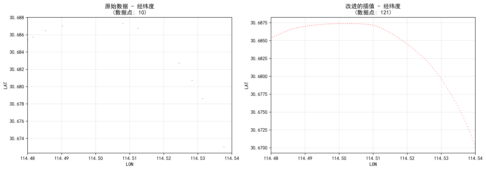
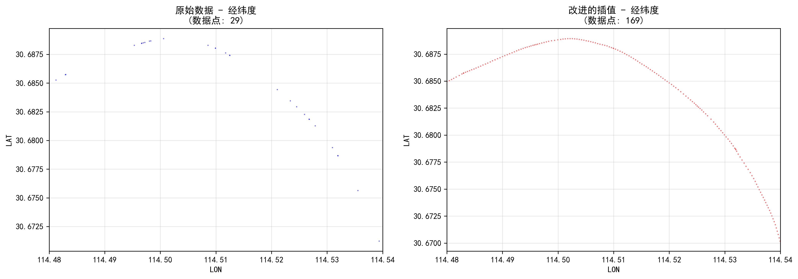
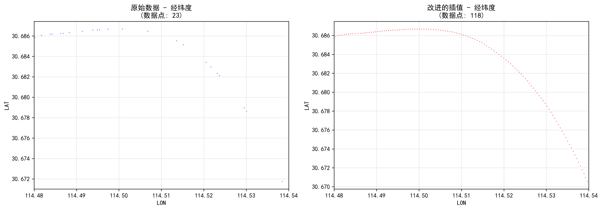
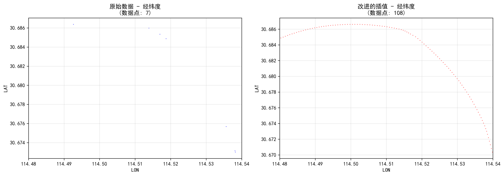

# 11月4日组会汇报

## 插值

### Akima 自适应样条插值。

对 Lat、Lon、Speed、Course 逐列插值；时间步长统一为10秒；仅在原始[min, max]区间内插值，不外推。

适合不均匀采样数据，C1连续、局部性强，对拐点和端点更稳，较少振荡与过冲。
生成等时序列，便于轨迹对齐、统计与可视化。

#### 流程

批量读取CSV，要求含UnixTime；按UnixTime排序并设为索引；不足100点跳过。

在原始时间范围内生成10秒新时间网格。

将索引转为相对秒；若时间不严格递增，对相等/倒序点加0.001秒保证单调。

使用Akima对各列插值到新网格。

若插值后点数 > 原始1.5倍，则保存结果CSV（补回UnixTime为首列）并输出经纬度散点对比图；否则跳过并记录原因。

_备注：当前未对Course的环变量特性或Speed非负性做特殊约束，仅作区间内插值。_

#### 结果

仅展示部分拐点处插值效果。

## 多步预测

### 