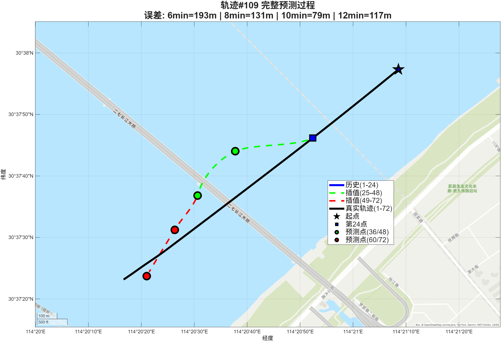

# 12月23日汇报

## 基线模型（Baseline）：标准 LSTM 直接回归 + MSE 损失

基线模型采用经典的序列回归框架，输入为长度为 $T$ 的历史轨迹序列 $\mathbf{X}_{1:T}$，每个时刻包含 $D=5$ 维特征（例如纬度、经度、速度、航向等）。模型以“直接回归未来状态”的方式进行多步预测：输出维度为 $2D=10$，对应两个未来时刻（如 $t+\Delta_1$、$t+\Delta_2$）的状态向量拼接，即
$$
\mathbf{y} = [\mathbf{y}_{t+\Delta_1};\mathbf{y}_{t+\Delta_2}] \in \mathbb{R}^{10}.
$$

在结构上，基线网络由两层 LSTM 构成：第一层 LSTM 输出整段序列隐藏状态（`OutputMode="sequence"`）用于提取时序特征，第二层 LSTM 输出最后时刻隐藏状态（`OutputMode="last"`）作为序列的全局表示，随后通过全连接层映射到 10 维输出，并采用标准回归层 `regressionLayer`（等价于对各输出维度等权的均方误差 MSE）进行优化。其目标函数可写为
$$
\mathcal{L}_{\text{MSE}}=\frac{1}{N}\sum_{i=1}^{N}\left\|\mathbf{y}_i-\hat{\mathbf{y}}_i\right\|_2^2,
$$
其中 $N$ 为样本数，$\hat{\mathbf{y}}_i$ 为网络预测。

| 预测点 | 说明 | 纬度 RMSE (度) | 经度 RMSE (度) | 速度 RMSE (节) | 位置距离 RMSE (米) | 位置距离 平均误差 (米) | 位置距离 中位数误差 (米) | 航向 RMSE (度) |
|:---:|:---:|:---:|:---:|:---:|:---:|:---:|:---:|:---:|
| 第6分钟（第36个点） | 直接预测 | 0.002370 | 0.005466 | 0.2431 | 585.52 | 471.07 | 384.96 | 18.0546 |
| 第8分钟（第48个点） | 直接预测 | 0.002897 | 0.005185 | 0.3257 | 591.44 | 420.09 | 280.28 | 22.5206 |
| 第10分钟（第60个点） | 递归预测 | 0.004160 | 0.007438 | 0.4149 | 848.63 | 634.61 | 456.43 | 12.0183 |
| 第12分钟（第72个点） | 递归预测 | 0.004094 | 0.006974 | 0.5115 | 807.60 | 563.61 | 402.39 | 13.5246 |

---

## 改进模型（Ours）：残差学习 + 自注意力 + 加权损失的多步轨迹预测网络

为进一步提升轨迹预测任务中**位置（Lat/Lon）精度**并增强模型对关键历史片段的建模能力，本文在基线模型基础上从三个方面进行改进：**（1）预测目标由绝对值回归改为残差学习；（2）时序编码器引入双向 LSTM 堆叠并加入自注意力机制；（3）用加权回归损失替代等权 MSE，使优化目标与位置误差指标更一致。** 改进模型仍保持与基线一致的输入/输出语义（输入 5 维序列，输出两个未来点共 10 维），从而保证对比公平。

---

### 1）任务形式改动：从“直接预测未来绝对状态”到“预测相对末端状态的残差”

基线模型直接学习映射 $\hat{\mathbf{y}}=f_\theta(\mathbf{X}_{1:T})$。然而在轨迹任务中，经纬度等绝对量的数值范围与运动变化量相比更大，且存在一定的非平稳性；直接回归绝对值会使网络同时承担“学习全局坐标尺度/偏置”和“学习局部运动变化”两类任务，可能削弱对运动模式的刻画能力。

因此，本文将监督信号重构为**残差（Residual）**。对每条输入序列，取末端观测点
$$
\mathbf{x}_t=\mathbf{X}_{1:T}(:,T)\in\mathbb{R}^{5}.
$$
将两个未来时刻真值 $\mathbf{y}_{t+\Delta_1},\mathbf{y}_{t+\Delta_2}$ 转换为相对末端点的残差：
$$
\mathbf{r}_{t+\Delta_k}=\mathbf{y}_{t+\Delta_k}-\mathbf{x}_t,\quad k\in\{1,2\},
$$
并拼接得到训练标签
$$
\mathbf{r}=[\mathbf{r}_{t+\Delta_1};\mathbf{r}_{t+\Delta_2}] \in \mathbb{R}^{10}.
$$
网络训练阶段输出残差 $\hat{\mathbf{r}}=f_\theta(\mathbf{X}_{1:T})$，推理阶段再恢复绝对预测：
$$
\hat{\mathbf{y}}_{t+\Delta_k}=\mathbf{x}_t+\hat{\mathbf{r}}_{t+\Delta_k}.
$$

该残差学习策略使模型重点拟合“从当前到未来的变化量”，在数值尺度上更集中、在语义上更贴近运动学变化（位移、速度变化、航向变化），通常有助于提升收敛稳定性与泛化能力。对应实现上，train_residual_attention_weighted.m 中对训练/验证标签均构造了 `YTrainResidual` 与 `YValResidual`，并在预测后将 `YPredResidual` 与 `lastPoint` 相加恢复 `YPred`，与上述公式一致。

---

### 2）结构改动：用“更强的时序编码 + 自注意力”替代基线的纯 LSTM 聚合

#### 2.1 双向 LSTM 堆叠替代单向 LSTM 编码
基线采用两层单向 LSTM（sequence → last）。改进模型将前端时序编码替换为两层 **BiLSTM（双向 LSTM）** 且均输出序列（`OutputMode="sequence"`），即得到时间维隐表示序列
$$
\mathbf{H}=[\mathbf{h}_1,\dots,\mathbf{h}_T].
$$
双向结构可在序列表示学习阶段同时利用前向与后向上下文信息，叠加两层编码能够提升模型对复杂时序依赖的表达能力；每层后均使用 Dropout（0.2）抑制过拟合。

#### 2.2 引入自注意力机制，突出关键历史片段（MATLAB ≥ 2020 分支）
在 BiLSTM 输出的序列隐表示基础上，改进模型进一步加入 `selfAttentionLayer(4, 64)`（4 头注意力，特征维 64）。自注意力通过计算不同时间步之间的相关性，对 $\mathbf{H}$ 进行加权重组，从而使网络能够自动强调对预测更关键的片段（例如转向、加减速、操纵动作发生的时段），并缓解仅依赖最后隐藏状态可能导致的信息瓶颈。

在注意力之后，模型使用一层 LSTM（`OutputMode="last"`）将增强后的序列压缩为固定长度向量，用于后续回归头预测 10 维残差。若 MATLAB 版本不支持 `selfAttentionLayer`，代码采用第三层 BiLSTM（`OutputMode="last"`）作为替代，从工程上保证可训练性；但本文核心改进思想仍是“强化时序编码能力并引入更有效的序列信息聚合”。

#### 2.3 回归头加深：更强的非线性映射能力
基线回归头为 `FC(128)+ReLU+FC(10)`。改进模型采用更深的回归头：`FC(256)+LeakyReLU+Dropout + FC(128)+LeakyReLU + FC(10)`。其中 LeakyReLU（负半轴斜率 0.01）有助于缓解 ReLU 在回归任务中可能出现的梯度“截断”问题；额外 Dropout 进一步提升泛化。

---

### 3）目标函数改动：由等权 MSE 改为加权回归损失，显式强化位置精度

基线使用 `regressionLayer` 对所有输出维度等权优化，等价于最小化 $\mathcal{L}_{\text{MSE}}$。然而轨迹预测的核心关注往往是地理位置误差（Lat/Lon），若对速度、航向与位置等维度一视同仁，可能出现模型在“易拟合维度”上损失下降更快，从而削弱对位置维度的优化强度。

因此，改进模型将回归层替换为自定义 `weightedRegressionLayer`，采用加权均方误差：
$$
\mathcal{L}_{\text{wMSE}}=\frac{1}{N}\sum_{i=1}^{N}\sum_{d=1}^{10} w_d\left(y_{i,d}-\hat{y}_{i,d}\right)^2.
$$
其中 $w_d$ 为各输出维度权重。结合脚本中的设定意图（训练日志中注明 *Lat/Lon=3.0, Speed=1.0, Course=1.5*），本文对位置相关维度赋予更高权重，从而在训练阶段显式提升位置误差在总损失中的占比，使优化目标与最终以地理距离为核心的评测指标更一致。

需要强调的是：改进模型的加权损失作用于**残差空间**（$\mathbf{r}$），即网络直接最小化残差预测误差的加权 MSE；推理时通过“末端点 + 残差”恢复绝对预测。

---

### 4）对比公平性与训练设置一致性说明

为保证与基线的可比性，本文在训练策略上尽可能保持一致：两者均采用 Adam 优化器、相同的 batch size（512）、相同的最大 epoch（350）、相同的初始学习率与分段衰减策略、相同的 L2 正则与梯度裁剪阈值，并使用相同训练/验证划分与相同归一化参数（$\mu,\sigma$）进行反归一化评估。差异主要来自于上述三点核心改动（残差目标、注意力/结构增强、加权损失）。

---

### 5）评估方式一致：以 Haversine 地理距离衡量位置误差

在评估阶段，两种模型均将输出反归一化回真实量纲，并基于经纬度使用 Haversine 公式计算球面距离误差，报告 RMSE、均值、中位数及阈值内比例（如 50 m 内）。不同之处在于：基线模型直接输出未来绝对状态；改进模型需要先将预测残差与序列末端点相加恢复绝对预测后再进行同样的地理距离评估。该评估流程保证最终对比均在真实空间距离意义下进行。

---

## 可放在“本文贡献/改进点”处的归纳句（同样可直接引用）

综上，本文相对于基线 LSTM 直接回归模型的改进体现在：**（1）采用残差学习将预测目标从绝对状态改为相对末端状态的增量，提高学习稳定性并强化运动模式建模；（2）以双向 LSTM 堆叠并结合自注意力机制进行序列特征增强，使模型能够自适应关注对未来轨迹更关键的历史片段；（3）设计加权回归损失函数提升位置维度在训练中的优化权重，从而更有效地降低地理位置误差。**

---

如果你把 `weightedRegressionLayer` 的具体实现文件（通常是一个自定义 layer 类）也发出来，我可以把“加权损失”的数学定义进一步写得**与代码完全一致**（包括权重如何对应 10 个输出维度、是否对两个预测时刻共享权重、是否做了均值归一等），这样论文表述会更严谨。