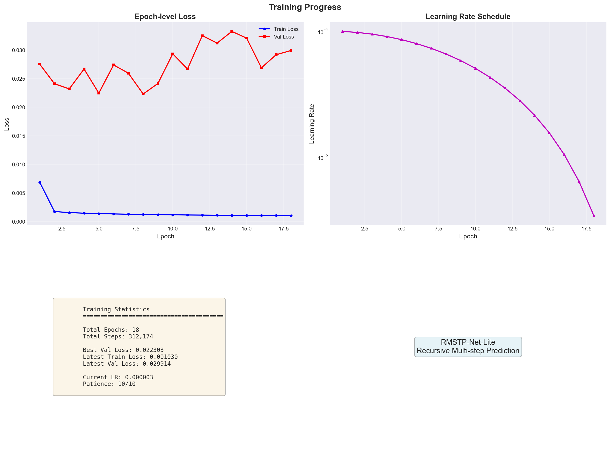
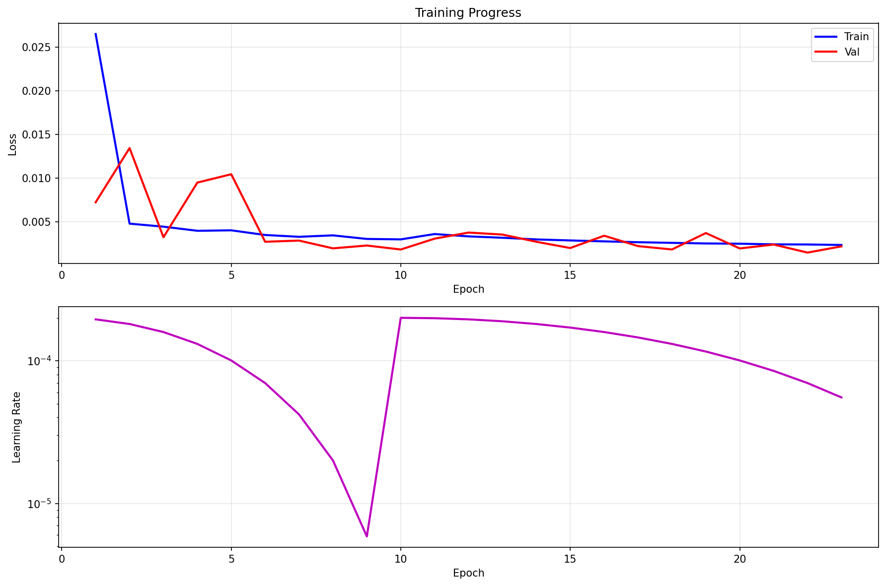

# 11月4日组会汇报

## 插值

### Akima 自适应样条插值。

对 Lat、Lon、Speed、Course 逐列插值；时间步长统一为10秒；仅在原始[min, max]区间内插值，不外推。

适合不均匀采样数据，C1连续、局部性强，对拐点和端点更稳，较少振荡与过冲。
生成等时序列，便于轨迹对齐、统计与可视化。

#### 流程

批量读取CSV，要求含UnixTime；按UnixTime排序并设为索引；不足100点跳过。

在原始时间范围内生成10秒新时间网格。

将索引转为相对秒；若时间不严格递增，对相等/倒序点加0.001秒保证单调。

使用Akima对各列插值到新网格。

若插值后点数 > 原始1.5倍，则保存结果CSV（补回UnixTime为首列）并输出经纬度散点对比图；否则跳过并记录原因。

_备注：当前未对Course的环变量特性或Speed非负性做特殊约束，仅作区间内插值。_

#### 结果

仅展示部分拐点处插值效果。

<div align=center></div>

<div align=center></div>

<div align=center></div>

<div align=center></div>

## 多步预测

__面向船桥避碰的核心场景，目标是在交通稠密与能见度受限时，提前识别未来4分钟的碰撞风险，并给出随后4分钟的船舶运动轨迹与态势展望，__
__帮助驾驶员把握最佳避让窗口。__

__在实际船桥避碰中，难点不是“看到现在”，而是“提前看见未来并留出操纵空间”。__
__因此采取两段式多步预测：先给出0–4分钟的风险提示（基于CPA/TCPA等指标），__
__再提供4–8分钟的轨迹与态势展望，用于方案评估与路径选择。基于这一需求，设计并训练了下面的预测模型。__

目标：学习10秒等时序的船舶轨迹模式，用4分钟历史预测未来4分钟经纬度（24步），并支持递归多步预测。

__目标要解决船桥避碰的提前量：不仅要在接下来4分钟内及时识别碰撞风险，还要再向前看4分钟，给出对方与本船的运动轨迹与态势，__
__帮助驾驶员在最佳窗口内按规避让。围绕这个两段式预警与展望目标，构建了如下预测模型。__

### RMSTPNet

基于Transformer的递归多步时间序列预测网络（Recursive Multi-step Time Series Prediction Network）。

#### 模型结构

- 输入与输出
  - 输入: [B, 24, 4]（10s间隔4分钟，特征=Lon, Lat, Speed, Course，均已归一化）
  - _过去4分钟的轨迹数据，间隔10秒一个点，共24个点；每个点有4个数。_
  - 输出: [B, 24, 2]（未来4分钟的 [Lon, Lat]，三段拼接：6+12+6）
  - _未来4分钟的位置（经度、纬度），同样每10秒一个点，共24个点。模型分三段给出：前1分钟、1–3分钟、3–4分钟，最后拼成完整序列。_
````python
# 配置中的窗口长度（10s间隔 → 24步 = 4分钟）
'hist_len': 24,
'pred_len': 24,
...
# 数据集切片处：history=24步×4特征，target=24步×2坐标
hist = features[start:start + self.hist_len]                 # [24, 4]
pred = features[start + self.hist_len:start + self.hist_len + self.pred_len, :2]  # [24, 2]
history = torch.FloatTensor(hist)
target = torch.FloatTensor(pred)
````

- 模块组成
  - 特征编码器（MLP）（两层全连接）
    - 4 → 64 → 128，激活ReLU，Dropout=0.3
    - _把每个时刻的4个原始数，先提炼到64维，再到128维，配合ReLU和Dropout_
    - 作用：将4维手工特征映射到更高维时序嵌入
````python
self.feature_encoder = nn.Sequential(
    nn.Linear(input_dim, 64),
    nn.ReLU(),
    nn.Dropout(dropout),
    nn.Linear(64, hidden_dim),
    nn.ReLU(),
    nn.Dropout(dropout)
)
````
  - 时序建模（双向GRU）
    - 2层、hidden=256、双向，输出步长特征为512维
    - 作用：捕获历史序列的双向依赖与动态模式
````python
self.temporal_model = nn.GRU(
    input_size=hidden_dim,
    hidden_size=gru_hidden,
    num_layers=2,
    batch_first=True,
    bidirectional=True,
    dropout=dropout
)
````
  - 注意力机制（时间加权汇聚）
    - 512 → 256 → 1，Softmax 时间维，得到加权和的上下文向量 [B, 512]
    - _给24个历史时刻自动打分，分数高代表更关键；按分数做加权汇总，得到一个“摘要向量”_
    - 作用：突出对预测最关键的历史时刻
````python
self.attention = nn.Sequential(
    nn.Linear(gru_hidden * 2, gru_hidden),
    nn.Tanh(),
    nn.Linear(gru_hidden, 1)
)
# 使用时：softmax打分并加权求和为上下文摘要
attention_weights = torch.softmax(self.attention(temporal_out), dim=1)  # [B,24,1]
context = torch.sum(attention_weights * temporal_out, dim=1)            # [B,512]
````
  - 多尺度预测头（3个分支）
    - Immediate: 512 → 256 → 6×2（0–1分钟）
    - Short-term: 512 → 256 → 12×2（1–3分钟）
    - Medium-term: 512 → 256 → 6×2（3–4分钟）
    - _基于“摘要向量”，分别预测三段未来：0–1分钟、1–3分钟、3–4分钟_
    - 作用：分尺度学习不同时间跨度的轨迹变化，短期变化快、长期更平稳，分开学更稳更准，最后拼接成24点
````python
self.multiscale_heads = nn.ModuleDict({
    'immediate': self._make_prediction_head(gru_hidden * 2, 6),   # 0-1分钟
    'short_term': self._make_prediction_head(gru_hidden * 2, 12), # 1-3分钟
    'medium_term': self._make_prediction_head(gru_hidden * 2, 6)  # 3-4分钟
})
def _make_prediction_head(self, input_dim, pred_points):
    return nn.Sequential(
        nn.Linear(input_dim, 256),
        nn.ReLU(),
        nn.Dropout(0.2),
        nn.Linear(256, pred_points * 2)  # 每点预测[lon, lat]
    )
````

- 前向数据流与张量形状
  - 输入 x[B,24,4]
  - _读入24个历史点（每点4个特征）_
  - 编码: [B,24,128]
  - _对每个点做特征提炼（更高维、更有信息）_
  - GRU: [B,24,512]
  - _用双向GRU理解整段历史（结合前后文）_
  - 注意力加权: 权重[B,24,1] → 上下文[B,512]
  - _用注意力挑出关键时刻，汇成摘要_
  - 三头预测: [B,6,2]、[B,12,2]、[B,6,2] → 拼接[B,24,2]
  - _三个分支分别产出近、中、远三段未来位置，拼成完整4分钟预测_
````python
encoded = self.feature_encoder(current_input)        # [B,24,128]
temporal_out, _ = self.temporal_model(encoded)       # [B,24,512]
attention_weights = torch.softmax(self.attention(temporal_out), dim=1)  # [B,24,1]
context = torch.sum(attention_weights * temporal_out, dim=1)            # [B,512]
predictions = {
    'immediate': self.multiscale_heads['immediate'](context).view(batch_size, 6, 2),
    'short_term': self.multiscale_heads['short_term'](context).view(batch_size, 12, 2),
    'medium_term': self.multiscale_heads['medium_term'](context).view(batch_size, 6, 2)
}
full_prediction = torch.cat([
    predictions['immediate'],
    predictions['short_term'],
    predictions['medium_term']
], dim=1)  # [B,24,2]
````

- 递归多步预测机制（怎么滚到更久的将来）
  - 循环 step=recursive_steps+1 次；每次用本轮预测的24点构造下一轮输入：
  - _先预测未来4分钟；再把这24个预测点当“新的历史”继续预测：_
    - Lon/Lat：使用预测坐标
    - _经度/纬度：直接用上次的预测结果。_
    - Speed：复用历史速度的均值
    - _速度：用历史速度的平均值近似。_
    - Course：由相邻预测点位移 atan2 计算后/360 归一化
    - _航向：用相邻预测点的位移方向计算出角度（再做归一化）。_
  - 作用：在4分钟基础上滚动扩展更多未来时长（默认1次 → 8分钟总预测）
````python
# 递归循环
for step in range(recursive_steps + 1):
    ...  # 预测得到 full_prediction
    if step < recursive_steps:
        current_input = self._build_recursive_input(current_input, full_prediction)

def _build_recursive_input(self, history_input, prediction):
    return self._compute_features_from_predictions(prediction, history_input)

def _compute_features_from_predictions(self, pred_coords, history_features):
    lon = pred_coords[:, :, 0:1]
    lat = pred_coords[:, :, 1:2]
    # 速度：复用历史速度均值
    hist_speed = history_features[:, :, 2:3].mean(dim=1, keepdim=True).expand(-1, pred_coords.size(1), -1)
    # 航向：由相邻预测位移计算方向角并/360归一化
    delta = pred_coords[:, 1:, :] - pred_coords[:, :-1, :]
    first_delta = delta[:, 0:1, :]
    all_deltas = torch.cat([first_delta, delta], dim=1)
    course_rad = torch.atan2(all_deltas[:, :, 1], all_deltas[:, :, 0])
    course_deg = (course_rad * 180 / np.pi) % 360
    course_norm = (course_deg / 360.0).unsqueeze(-1)
    return torch.cat([lon, lat, hist_speed, course_norm], dim=-1)  # [B,24,4]
````

- 设计动机
  - MLP 提升表征维度；BiGRU 捕获时序依赖；注意力聚焦关键历史；多尺度头提升不同时间跨度的拟合能力；递归机制支持更长时域外推。
  - _分段预测：把“近、中、远”拆开学，难点各自解决，整体更稳。_
  - _注意力：自动把精力放在转弯、变速等关键片段。_
  - _双向记忆：既不丢趋势，也不丢细节。_
  - _递归扩展：先拿近未来，再滚动到更长时间范围。_

#### 损失函数与优化

一、总损失与各项作用
- 主MSE（全24步）: 度量整段未来轨迹位置误差，保证整体精度。
- 多尺度MSE（6/12/6）: 对0–1分、1–3分、3–4分分别考核，权重0.4/0.4/0.2，保证近中远三段都学稳。
- 平滑约束（L1，基于相邻步差分）: 让预测的步进变化贴近真实，抑制锯齿与颤动。
- 递归步MSE（按0.5^i衰减）: 若做滚动多步预测，对后续轮的输出也约束，稳住长期外推。
- 权重汇总（配置): total = 0.5×MSE + 0.3×Scale + 0.1×Smooth + 0.1×Recursive

二、对应代码
````python
# 计算四项损失并加权汇总
mse_loss = self.criterion_mse(predictions, targets)

scale_loss = 0
scale_loss += 0.4 * self.criterion_mse(pred_dict['immediate'], targets[:, :6, :])
scale_loss += 0.4 * self.criterion_mse(pred_dict['short_term'], targets[:, 6:18, :])
scale_loss += 0.2 * self.criterion_mse(pred_dict['medium_term'], targets[:, 18:, :])

pred_diff = predictions[:, 1:, :] - predictions[:, :-1, :]
target_diff = targets[:, 1:, :] - targets[:, :-1, :]
smooth_loss = self.criterion_smooth(pred_diff, target_diff)

recursive_loss = 0
if all_predictions is not None and len(all_predictions) > 1:
    for i, pred in enumerate(all_predictions[1:], 1):
        weight = 0.5 ** i
        recursive_loss += weight * self.criterion_mse(pred, targets)

total_loss = (
    self.config['mse_weight'] * mse_loss +         # 0.5
    self.config['scale_weight'] * scale_loss +     # 0.3
    self.config['smooth_weight'] * smooth_loss +   # 0.1
    self.config.get('recursive_weight', 0.2) * recursive_loss  # 0.1
)
````

三、优化器与梯度裁剪
- 优化器：AdamW，lr=1e-4，weight_decay=1e-4。
- 梯度裁剪：全局范数1.0，抑制梯度爆炸；同时对NaN/Inf做跳过防护。
````python
self.optimizer = optim.AdamW(
    model.parameters(),
    lr=config['learning_rate'],       # 1e-4
    weight_decay=config['weight_decay']  # 1e-4
)

loss.backward()
total_norm = torch.nn.utils.clip_grad_norm_(self.model.parameters(), max_norm=1.0)
if torch.isnan(total_norm) or torch.isinf(total_norm):
    self.optimizer.zero_grad()
    continue
self.optimizer.step()
````

四、学习率调度
- 余弦退火带重启：T0=20，eta_min=1e-6；每轮 step 一次。
````python
self.scheduler = optim.lr_scheduler.CosineAnnealingWarmRestarts(
    self.optimizer, T_0=20, T_mult=1, eta_min=1e-6
)
...
self.scheduler.step()
````

五、早停策略
- patience=10：验证集不下降则计数，超过阈值停止；有提升则保存best并清零计数。
````python
if val_loss < self.best_val_loss:
    self.best_val_loss = val_loss
    self.patience_counter = 0
    self.save_checkpoint('best_model.pth', epoch, val_loss)
else:
    self.patience_counter += 1

if self.patience_counter >= self.config['patience']:  # 10
    print("Early stopping triggered")
    break
````

六、配置权重（默认）
````python
config = {
  'mse_weight': 0.5, 'scale_weight': 0.3,
  'smooth_weight': 0.1, 'recursive_weight': 0.1,
  'learning_rate': 1e-4, 'weight_decay': 1e-4,
  'patience': 10
}
````

#### 训练与评估

<div align=center></div>

可以看到结果并不理想，主要出在航向特征。把0~360°当普通实数，导致在跨0/360°时出现数值大跳，误导了损失和注意力，转向段误差显著。将航向改成sin/cos
两维周期编码，把角度映射到单位圆，消除了不连续点。于是从4维升级为5维，其他设置基本不变，转向和平滑性明显提升，长程稳定性也更好。

#### 优化

一、总体目标（相同）
- 用过去4分钟（10s×24点）预测未来4分钟位置（24点），支持递归扩展更长时长。

二、关键差异一览
- 特征输入：由4维升级为5维（新增航向sin/cos），更好处理0/360度环变量。
- 编码与时序：更深的编码器（含LayerNorm）、3层双向GRU（更大通道），引入多头注意力。
- 注意力与汇聚：从“时间加权汇聚一个摘要”改为“多头自注意力后取最后时刻表示”，上下文获取方式不同。
- 预测头：更深的多尺度头（两层+LN+Dropout），容量更大。
- 损失与优化：权重配比、学习率与调度器参数、早停耐心、batch等均有调整。
- 递归特征构造：航向用sin/cos重建，速度用历史均值，递归更稳。

三、特征与数据管线（5维 vs 4维）
- 新版把航向编码为正弦/余弦，避免0/360跳变；速度做min-max归一化；经纬度缩放到[-1,1]。
````python
class FeatureEngineering:
    """5维特征: Lon, Lat, Speed, Course_sin, Course_cos"""
    def compute_features(self, df):
        # 经纬度归一化到[-1,1]
        norm_lat, norm_lon = self.normalizer.normalize_geographic(lat, lon)
        # 速度min-max
        norm_speeds = [self.normalizer.normalize_speed(s) for s in df['Speed'].values]
        # 航向周期编码
        course_rad = np.deg2rad(df['Course'].values)
        features.extend([np.sin(course_rad), np.cos(course_rad)])
        # → shape: [N, 5]
````
- 数据集切片保持不变：历史[24,5]，目标为经纬度[24,2]。
````python
hist = features[start:start + self.hist_len]                   # [24, 5]
pred = features[start + self.hist_len:start + self.hist_len + self.pred_len, :2]  # [24, 2]
````

四、模型架构（更深、更强）
- 更深特征编码器：两层全连接+LayerNorm+Dropout，输出到hidden_dim（默认256）。
````python
self.feature_encoder = nn.Sequential(
    nn.Linear(input_dim, 128),
    nn.LayerNorm(128),
    nn.ReLU(),
    nn.Dropout(dropout),
    nn.Linear(128, hidden_dim),
    nn.LayerNorm(hidden_dim),
    nn.ReLU(),
    nn.Dropout(dropout)
)
````
- 时序建模：3层双向GRU，通道更大（gru_hidden=512 → 双向输出1024）。
````python
self.temporal_model = nn.GRU(
    input_size=hidden_dim,
    hidden_size=gru_hidden,
    num_layers=3,
    batch_first=True,
    bidirectional=True,
    dropout=dropout
)
````
- 注意力：从“单头打分+时间加权求和”改为“多头自注意力”，然后取最后一个时间步作为上下文。
````python
self.attention = nn.MultiheadAttention(
    embed_dim=gru_hidden * 2, num_heads=8, dropout=dropout, batch_first=True
)
attn_out, _ = self.attention(temporal_out, temporal_out, temporal_out)
context = attn_out[:, -1, :]   # 取最后时刻作为上下文表示
````
- 多尺度预测头：更深两层（512→256）再到输出，附带LayerNorm/Dropout，容量更强。
````python
def _make_head(self, input_dim, pred_points):
    return nn.Sequential(
        nn.Linear(input_dim, 512),
        nn.LayerNorm(512),
        nn.ReLU(),
        nn.Dropout(0.15),
        nn.Linear(512, 256),
        nn.ReLU(),
        nn.Dropout(0.15),
        nn.Linear(256, pred_points * 2)
)
````

五、递归多步预测（航向sin/cos，更稳）
- 用预测的位移计算航向角，再转为sin/cos；速度沿用历史均值，作为下一轮输入的速度通道。
````python
def _build_recursive_input(self, history_input, prediction):
    # lon/lat 来自预测
    hist_speed = history_input[:, :, 2:3].mean(dim=1, keepdim=True).expand(-1, pred_len, -1)
    delta = prediction[:, 1:, :] - prediction[:, :-1, :]
    first_delta = delta[:, 0:1, :]
    all_deltas = torch.cat([first_delta, delta], dim=1)
    course_rad = torch.atan2(all_deltas[:, :, 1], all_deltas[:, :, 0])
    course_sin = torch.sin(course_rad).unsqueeze(-1)
    course_cos = torch.cos(course_rad).unsqueeze(-1)
    return torch.cat([lon, lat, hist_speed, course_sin, course_cos], dim=-1)  # [B,24,5]
````

六、损失与优化（配比与调度不同）
- 损失配比：修改为 0.4×MSE + 0.3×分段 + 0.2×平滑 + 0.1×递归；分段内部权重为 0.3/0.4/0.3（近/中/远）。
- 对比上版（0.5/0.3/0.1/0.1 与 0.4/0.4/0.2 的分段），本版更强调中段，同时加大平滑约束。
````python
mse_loss = self.criterion_mse(predictions, targets)
scale_loss = (
    0.3 * self.criterion_mse(pred_dict['immediate'], targets[:, :6, :]) +
    0.4 * self.criterion_mse(pred_dict['short_term'], targets[:, 6:18, :]) +
    0.3 * self.criterion_mse(pred_dict['medium_term'], targets[:, 18:, :])
)
pred_diff = predictions[:, 1:, :] - predictions[:, :-1, :]
target_diff = targets[:, 1:, :] - targets[:, :-1, :]
smooth_loss = self.criterion_smooth(pred_diff, target_diff)
recursive_loss = sum((0.5 ** i) * self.criterion_mse(pred, targets)
                     for i, pred in enumerate(all_predictions[1:], 1)) if len(all_predictions) > 1 else 0
total_loss = (self.config['mse_weight'] * mse_loss +
              self.config['scale_weight'] * scale_loss +
              self.config['smooth_weight'] * smooth_loss +
              self.config['recursive_weight'] * recursive_loss)
````
- 优化与调度：lr=2e-4（更大），AdamW，CosineAnnealingWarmRestarts(T0=10, T_mult=2, eta_min=1e-6)；梯度裁剪1.0；早停耐心15（上版10）。
````python
self.optimizer = optim.AdamW(model.parameters(), lr=config['learning_rate'], weight_decay=config['weight_decay'])
self.scheduler = optim.lr_scheduler.CosineAnnealingWarmRestarts(self.optimizer, T_0=10, T_mult=2, eta_min=1e-6)
...
loss.backward()
torch.nn.utils.clip_grad_norm_(self.model.parameters(), max_norm=1.0)
...
if self.patience_counter >= self.config['patience']:  # 15
    print("\n⏹️  早停触发 (epoch {epoch+1})")
    break
````

七、训练管理（更完善的续训与记录）
- checkpoint包含模型/优化器/调度器/历史；支持相对路径续训；自动绘制LR曲线与损失曲线，保存JSON与CSV。
````python
checkpoint = {
  'epoch': epoch, 'global_step': self.global_step,
  'model_state_dict': self.model.state_dict(),
  'optimizer_state_dict': self.optimizer.state_dict(),
  'scheduler_state_dict': self.scheduler.state_dict(),
  'best_val_loss': self.best_val_loss, 'patience_counter': self.patience_counter,
  'history': self.history, 'config': self.config
}
torch.save(checkpoint, self.checkpoint_dir / filename)
````

八、总结
- 在不改变任务的前提下，这版把特征做成5维（航向sin/cos），网络更深更强（LayerNorm+3层BiGRU+多头注意力+更深的多尺度头），损失配比强调中段与平滑，优化更激进（更大学习率、余弦重启更频繁、耐心更长），并完善了续训与记录，整体更稳、更适合复杂轨迹与长程外推。

#### 训练

目前训练了23轮，损失函数曲线与学习率曲线如下：
<div align=center></div>

可以看到训练与验证损失均稳步下降，未见过拟合迹象。接下来继续训练至早停，并进行测试评估。