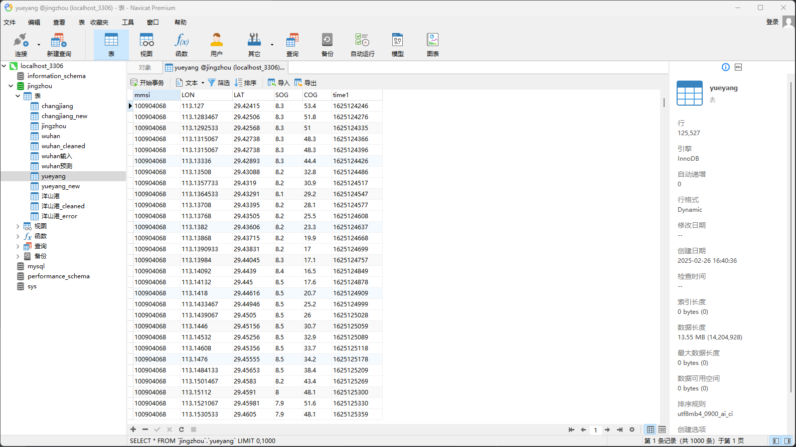
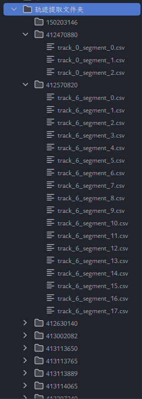
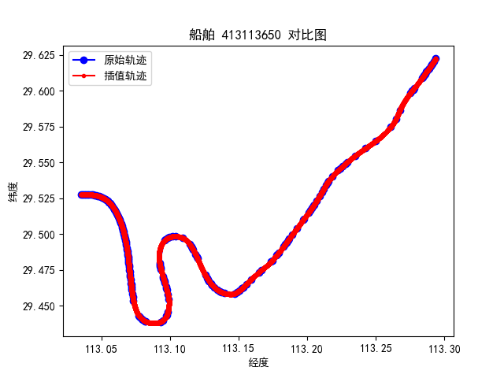
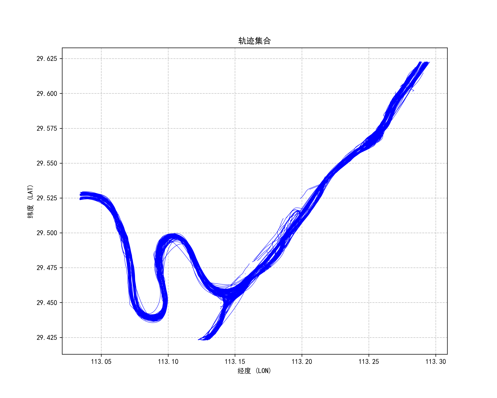
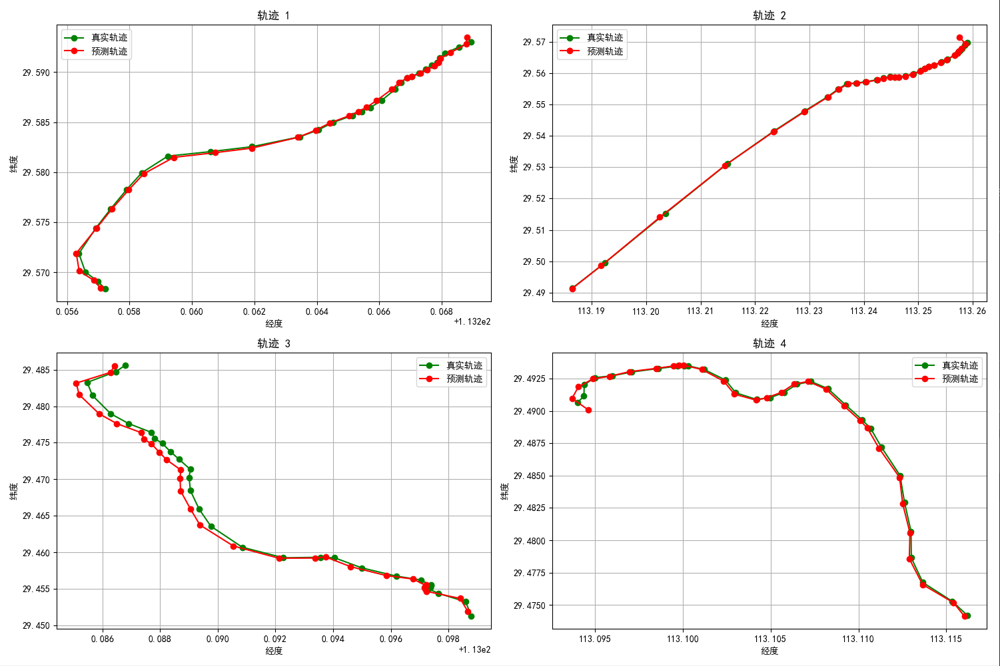

# 5月6日组会汇报

## AIS数据清洗

在 AIS 信号的发送、传输、接收过程中，数据难免会出现中断或缺失，且在现实环境中的 AIS 数据会有冗余、异常等情况，所以首先对数据进行清洗工作。

将csv数据导入数据库，再通过限制条件对AIS数据进行清洗

(1)按照mmsi和time升序排序

(2)删除mmsi不是9位的记录

(3)删除空值

(4)删除经度、纬度、对地航速不在有效范围内的数据

(5)删除连续5个及以上SOG为0的数据点

(6)使用欧式距离-速度阈值法检测并移除漂移点

欧式距离-速度阈值法用于检测和移除AIS数据中的漂移点，主要思路如下：

#### 原理
- 计算相邻两个时间点之间船舶位置的欧式距离
- 根据时间间隔和船舶最大合理速度，计算理论上船舶能够移动的最大距离
- 如果实际距离超过理论最大距离，则判定为漂移点

#### 具体实现
1. 按照船舶MMSI分组，对每组船舶数据按时间排序
2. 计算相邻时间点间的时间差（转换为小时）
3. 计算相邻点之间的欧式距离（使用经纬度坐标）
4. 计算理论最大距离
   - 根据船舶最大速度和时间差计算理论最大距离
   - 理论最大距离 = 船舶最大速度 × 时间差
5. 当实际欧式距离大于理论最大距离时，标记为漂移点并移除

#### 优点
- 考虑了时间因素，不同时间间隔有不同阈值
- 能够有效识别突然出现在远离正常轨迹的异常点
- 实现简单，计算效率较高

通过这种方法，检测移除数据中的漂移点，提高数据质量。

针对内河AIS数据漂移点的欧式距离处理方法，结合搜索结果，以下是专业解决方案：

**欧式距离-速度阈值法**：
   
   • 计算相邻两点间欧式距离：

   $d = \sqrt{(lon_2-lon_1)^2 + (lat_2-lat_1)^2}$

   • 根据时间间隔$\Delta t$和船舶最大速度$v_{max}$计算理论最大距离：$d_{max} = v_{max} \cdot \Delta t$
   
   • 判定条件：当$d > d_{max}$时标记为漂移点

做完上述清理步骤后，再保存至一个新的数据库中

## 轨迹提取

在我目前的代码中，我是按照mmsi将船舶区分开，然后计算相邻两点的时间差，若时间差大于30分钟，则把这两点分别作为上一段轨迹的终点和下一段轨迹的起点。并且去除掉了少于30个点的轨迹段。

不过实际上轨迹分段应该放在插值之后，这个在后续工作中会修改。

## 插值处理

插值处理的核心步骤如下：

## 1. 数据分段
- 按时间顺序排序轨迹点
- 当相邻两点时间差超过1800秒(30分钟)时，将轨迹分为不同段(这个地方分段是由于时间间隔太久会导致插值效果不好)
- 舍弃少于3个点的短轨迹段(轨迹点太少也会导致插值效果不好)

## 2. 卡尔曼滤波前向处理
- 使用四维状态向量：[纬度, 经度, 纬度速度, 经度速度]
- 状态转移矩阵F实现位置和速度的关联
- 对每个时间步进行预测和更新：
  - 预测：根据上一状态推算当前状态
  - 更新：当有观测数据时，结合测量值修正状态估计

## 3. RTS平滑器后向处理
- 对前向滤波结果进行反向平滑
- 利用未来信息进一步优化轨迹估计
- 减少轨迹抖动，提高平滑性

## 4. 计算轨迹参数
- 基于平滑后的速度向量计算SOG(船速)和COG(航向)
- 生成均匀间隔的完整轨迹点，填补原始数据缺失

## 数据处理流程
1. 从数据库读取原始AIS数据
2. 按船舶MMSI分组
3. 对每艘船舶轨迹应用卡尔曼滤波插值
4. 将插值结果保存为CSV文件
5. 生成原始轨迹与插值轨迹的对比图

这种方法的优势在于能够处理不规则时间间隔的AIS数据，生成连续平滑的轨迹，并且保留了船舶运动的物理特性。

以下是部分对比图

我这里是插值到了每一秒中。

### 处理前后的轨迹集合对比

处理前的轨迹集合

处理后的轨迹集合

## ~~轨迹预测(未完成)~~

刚刚说到的轨迹分段问题，实际上是要在插值之后再进行分段的。

而我目前代码中提取轨迹时分段是因为之前我忽略了插值，而直接使用原始数据来进行训练。

我想使用的方法是将传统卡尔曼滤波与深度学习模型相结合，使用Bi-GRU捕捉轨迹的时序依赖关系，注意力机制可动态加权重要轨迹点，针对大规模轨迹数据的优化设计。

以下是没有插值的情况下跑出来的结果：

## 长江武汉段数据

长江武汉段数据的处理流程与上述相似，主要区别在于数据量较大，处理时间较长。

第一次清洗

绘制边界框

第二次清洗

