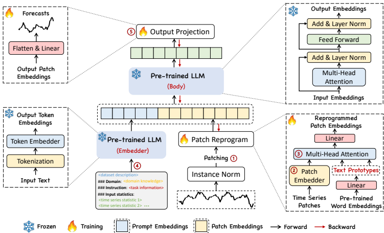
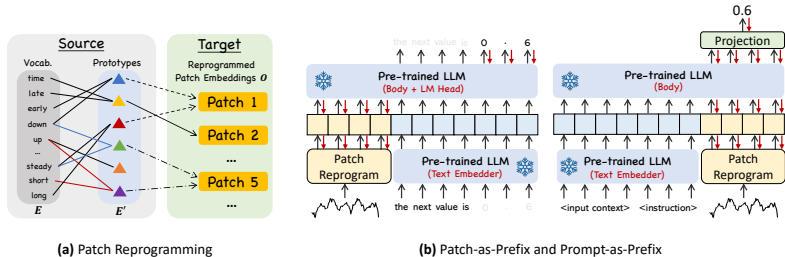
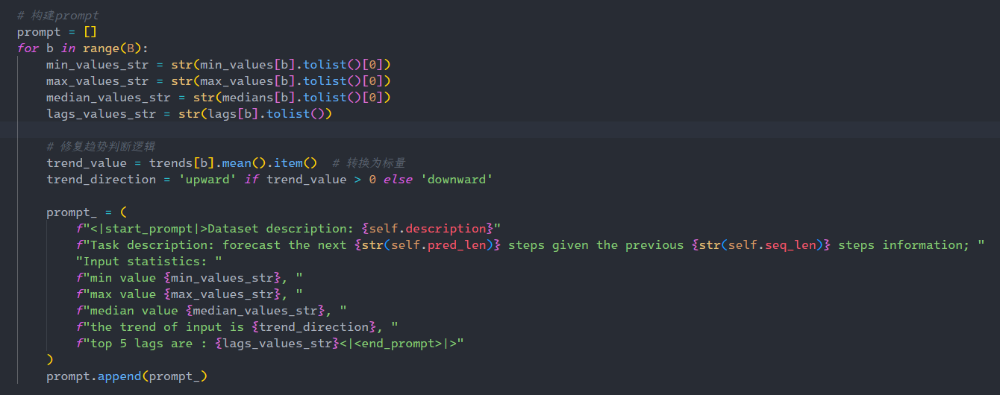
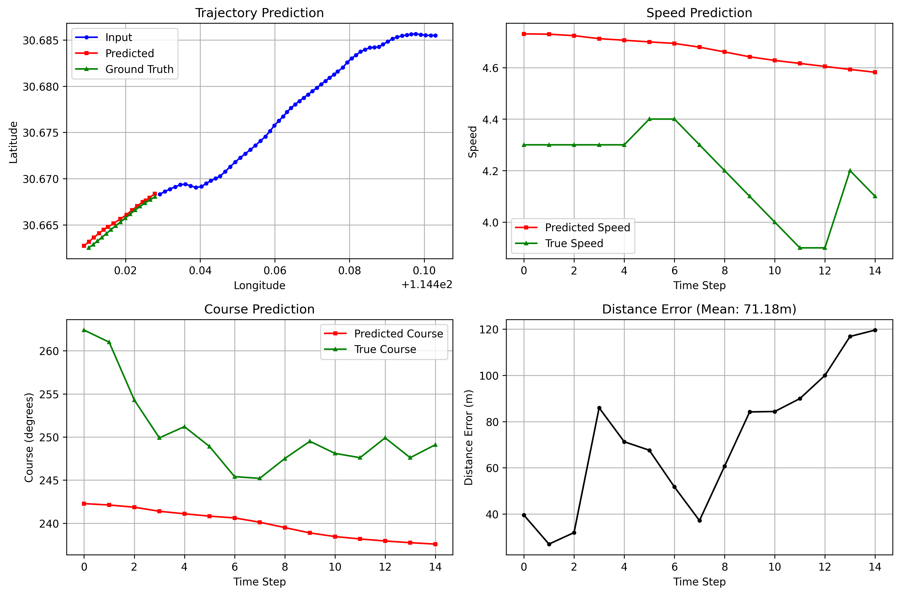

# <center> 汇报

## 总表

## LSTM

模型训练的详细参数如下：

*   **优化器 (Optimizer)**: Adam
*   **损失函数 (Loss Function)**: L1Loss (平均绝对误差 MAE)
*   **学习率 (Learning Rate)**: 0.001
*   **训练轮次 (Epochs)**: 500
*   **批量大小 (Batch Size)**: 32
*   **LSTM 输入特征数 (Input Size)**: 2 (Lat, Lon)
*   **LSTM 输入步长 (Input Steps)**: 60 (使用过去60个时间步的Lat, Lon)
*   **LSTM 隐藏层大小 (Hidden Size)**: 64
*   **LSTM 输出步长 (Output Steps)**: 15 (预测未来15个时间步的Lat, Lon)

### 训练过程中的损失曲线如下：

<div align=center></div>

### 预测结果

<div align=center></div>
<div align=center></div>

### 评估指标

<div align=center></div>


## Bi-LSTM

模型训练的详细参数如下：

*   **优化器 (Optimizer)**: Adam (`torch.optim.Adam`)
*   **损失函数 (Loss Function)**: L1Loss (Mean Absolute Error, `nn.L1Loss()`)
*   **学习率 (Learning Rate)**: 0.001
*   **训练轮次 (Epochs)**: 500
*   **批量大小 (Batch Size)**: 32
*   **LSTM 输入特征数 (Input Size)**: 2 (对应 'Lat', 'Lon')
*   **LSTM 输入步长 (Input Steps)**: 60
*   **LSTM 隐藏层大小 (Hidden Size)**: 64
*   **LSTM 输出步长 (Output Steps)**: 15
*   **Dropout**: 0.0 (因为 `num_layers` 默认为1，所以 `lstm_dropout` 为0.0)

### 训练过程中的损失曲线如下：

<div align=center></div>

### 预测结果

<div align=center></div>
<div align=center></div>

### 评估指标

<div align=center></div>

## GRU

模型训练的详细参数如下：

*   **优化器 (Optimizer)**: Adam
*   **损失函数 (Loss Function)**: L1Loss (平均绝对误差 MAE)
*   **学习率 (Learning Rate)**: 0.001
*   **训练轮次 (Epochs)**: 500
*   **批量大小 (Batch Size)**: 32
*   **GRU 输入特征数 (Input Size)**: 2 (纬度和经度)
*   **GRU 输入步长 (Input Steps)**: 60 (代码中 `X = input_data[:60]`)
*   **GRU 隐藏层大小 (Hidden Size)**: 64
*   **GRU 输出步长 (Output Steps)**: 15
*   **dropout**: 代码中定义的 `GRUPredictor` 模型没有显式使用 dropout 层。

### 训练过程中的损失曲线如下：

<div align=center></div>

### 预测结果

<div align=center></div>
<div align=center></div>

### 评估指标

<div align=center></div>

## Bi-GRU

模型训练的详细参数如下：

**模型架构 (`BiGRUPredictor`)**
*   `input_size`: `2` (输入特征维度，即经纬度)
*   `hidden_size`: `64` (GRU 隐藏层大小)
*   `output_steps`: `15` (预测未来时间步的数量)
*   `num_layers`: `1` (GRU 层数，使用默认值)
*   `dropout_prob`: `0.0` (Dropout 概率，使用默认值)

**训练超参数 (`train_model` 函数)**
*   `epochs`: `500` (训练轮数，使用默认值)
*   `learning_rate` (lr): `0.001` (学习率，使用默认值)
*   损失函数: `nn.L1Loss()` (平均绝对误差, MAE)
*   优化器: `torch.optim.Adam`

**数据加载器 (`DataLoader`)**
*   `batch_size`: `32` (每个批次的样本数)
*   `shuffle`: `True` (在每个 epoch 开始时打乱数据)

### 训练过程中的损失曲线如下：

<div align=center></div>

### 预测结果

<div align=center></div>
<div align=center></div>

### 评估指标

<div align=center></div>

## Informer

以下是 `train.py` 脚本中模型训练的主要参数：

### 模型架构参数

这些参数在初始化 `InformerPredictor` 类时设置：

*   `enc_in`: 2 (编码器输入维度，即纬度和经度)
*   `dec_in`: 2 (解码器输入维度)
*   `c_out`: 2 (输出维度)
*   `seq_len`: 60 (输入序列长度)
*   `label_len`: 1 (标签长度)
*   `out_len`: 15 (预测序列长度)
*   `factor`: 3 (ProbSparse 注意力因子)
*   `d_model`: 512 (模型维度)
*   `n_heads`: 8 (注意力头数)
*   `e_layers`: 3 (编码器层数)
*   `d_layers`: 2 (解码器层数)
*   `d_ff`: 1024 (前馈网络维度)
*   `dropout`: 0.15 (Dropout 率)
*   `activation`: 'gelu' (激活函数)

### 训练超参数

这些参数在调用 `train_model` 函数时设置：

*   `epochs`: 500 (最大训练轮数)
*   `lr`: 0.0001 (学习率)
*   `patience`: 50 (早停的耐心轮数)
*   `min_delta`: 5e-5 (判断模型是否有改进的最小阈值)
*   `batch_size`: 32 (在 `DataLoader` 中设置)
*   **损失函数**: `nn.L1Loss()` (平均绝对误差, MAE Loss)
*   **优化器**: `torch.optim.Adam`

### 训练过程中的损失曲线如下：

<div align=center></div>

### 预测结果

<div align=center></div>
<div align=center></div>

### 评估指标

<div align=center></div>

## TimesNet

以下是 train.py 脚本中模型训练的主要参数：

**模型架构 (TimesNetPredictor):**
*   `seq_len`: 输入序列长度，设置为 `60`。
*   `pred_len`: 预测序列长度，设置为 `15`。
*   `input_size`: 输入特征维度，设置为 `2` (Lat, Lon)。
*   `d_model`: 模型内部的隐藏层维度，设置为 `128`。
*   `d_ff`: TimesBlock内部前馈网络的维度，设置为 `256`。
*   `top_k`: FFT选择的周期数量，设置为 `3`。
*   `num_kernels`: Inception模块中的卷积核数量，设置为 `8`。
*   `e_layers`: TimesBlock的层数（编码器层数），设置为 `3`。
*   `dropout`: Dropout比率，设置为 `0.1`。

**训练过程 (train_model):**
*   `epochs`: 训练轮数，设置为 `500`。
*   `lr` (learning_rate): 初始学习率，设置为 `0.0003`。
*   **损失函数 (CombinedLoss)**:
    *   `mse_weight`: MSE损失的权重，设置为 `0.3`。
    *   `mae_weight`: MAE损失的权重，设置为 `0.7`。
*   **优化器 (AdamW)**:
    *   `weight_decay`: 权重衰减，设置为 `1e-4`。
*   **学习率调度器 (ReduceLROnPlateau)**:
    *   `mode`: 'min' (当监控指标停止下降时降低学习率)。
    *   `factor`: 学习率降低的因子，设置为 `0.5`。
    *   `patience`: 学习率调度器的耐心轮数，设置为 `8`。
    *   `min_lr`: 学习率的下限，设置为 `1e-7`。
*   **早停机制 (EarlyStopping)**:
    *   `patience`: 早停的耐心轮数，设置为 `25`。
    *   `min_delta`: 认为损失没有改善的最小变化量，设置为 `1e-6`。
*   **梯度裁剪**:
    *   `max_norm`: 梯度的最大范数，设置为 `1.0`。

**数据加载:**
*   `batch_size`: 训练和验证数据加载器的批处理大小，设置为 `32`。
*   `num_workers`: 数据加载使用的工作进程数，设置为 `4`。

**数据增强 (augment_data):**
*   `noise_factor`: 添加高斯噪声的因子，设置为 `0.0005`。
*   `rotation_factor`: 微小旋转的角度因子，设置为 `0.05`。

### 训练过程中的损失曲线如下：

<div align=center></div>

### 预测结果

<div align=center></div>
<div align=center></div>

### 评估指标

<div align=center></div>

TimesNet模型的训练中，使用了早停机制，在验证集上监控MAE指标，当连续25个epoch没有改善时停止训练。最终训练轮次仅使用了89轮。

## Time-LLM

Time-LLM 是一种创新的时间序列预测框架，通过重新编程大型语言模型（LLMs）来实现高效的时间序列预测，同时保持主干语言模型的完整性。以下是其核心特点和创新点的详细介绍：

1. 核心思想

Time-LLM 的核心目标是将时间序列数据与自然语言模态对齐，从而利用LLMs强大的模式识别和推理能力进行预测。其关键创新包括：
• 输入重编程：将时间序列数据转换为文本原型表示，使其更适合语言模型处理。

• Prompt-as-Prefix (PaP)：通过自然语言提示增强模型的推理能力，指导输入补丁的转换。

• 轻量级适配：仅更新输入转换和输出投影的参数，保持主干LLM冻结，提高效率。

<div align=center></div>

2. 技术实现

输入处理

1. 分块与嵌入：将多变量时间序列分割为单变量序列，通过可逆实例归一化（RevIN）和分块操作生成补丁嵌入。
2. 补丁重编程：使用多头交叉注意力将补丁嵌入与预训练的词嵌入对齐，学习文本原型（如“短期上升”“稳定下降”）以表征局部时间模式。
   • 公式：  

$$Z_{k}^{(i)} = \text{SOFTMAX}\left(\frac{Q_{k}^{(i)}K_{k}^{(i)\top}}{\sqrt{d_{k}}}\right)V_{k}^{(i)}$$

3. Prompt-as-Prefix：添加包含数据集上下文、任务指令和统计信息（如趋势、滞后）的自然语言提示，增强模型对时间序列的理解。

<div align=center></div>

输出投影

LLM输出的表示经过扁平化和线性投影，生成最终的预测结果。

### 训练与评估

### 1. 数据准备阶段
从指定目录读取所有CSV格式的AIS数据文件，提取纬度、经度、速度、航向四个关键特征，使用MinMaxScaler进行归一化处理，构建编码器输入序列（60个时间步）、解码器输入序列和目标输出序列（15个时间步）。

### 2. 数据集划分
按照8:1:1的比例划分训练集、验证集和测试集，使用批处理方式组织数据，每批32个样本。

### 3. 模型架构 - TimeLLM设计

**核心架构理念**
TimeLLM是一个创新的时间序列预测模型，其核心思想是将大语言模型的强大表示能力应用到时间序列预测任务中。该模型认为时间序列数据虽然是数值型的，但其背后蕴含着丰富的模式和语义信息，这些信息可以通过预训练的语言模型来捕获和理解。

**LLM集成的关键组件**

**1. 数据到文本的转换机制**
- 将数值型的轨迹序列转换为自然语言描述
- 例如：将"[纬度:31.2, 经度:121.5, 速度:15.3, 航向:245]"转换为"船舶位于北纬31.2度、东经121.5度，以15.3节的速度向西南方向航行"
- 这种转换使得原本的数值序列具有了语义含义

<div align=center></div>

根据您的代码，我来给出具体的自然语言描述示例。这个语言描述是在 `TimeLLM` 的 `forward` 方法中动态生成的，用于将船舶轨迹的统计特征转换为自然语言 prompt。

#### 具体示例

假设有一个船舶轨迹数据批次，经过统计计算后得到以下数值：

**原始统计数据：**
- 最小值: [31.123, 120.456, 5.2, 180.5] (纬度、经度、速度、航向)
- 最大值: [31.789, 121.234, 18.7, 270.8]
- 中位数: [31.456, 120.845, 12.3, 225.6]
- 趋势值: 0.02 (正数，表示上升趋势)
- 自相关滞后: [0.85, 0.72, 0.45, 0.23, 0.12]

**生成的自然语言描述：**

```
<|start_prompt|>Dataset description: time series forecasting dataset
Task description: forecast the next 15 steps given the previous 60 steps information; 
Input statistics: min value 31.123, max value 31.789, median value 31.456, 
the trend of input is upward, top 5 lags are : [0.85, 0.72, 0.45, 0.23, 0.12]<|<end_prompt>|>
```

#### 更详细的船舶轨迹示例

如果我们针对船舶轨迹数据进行更具体的描述，prompt 可能是这样的：

**场景1：船舶正在加速**
```
<|start_prompt|>Dataset description: ship trajectory forecasting dataset
Task description: forecast the next 15 steps given the previous 60 steps information; 
Input statistics: min value 8.5, max value 16.2, median value 12.8, 
the trend of input is upward, top 5 lags are : [0.92, 0.78, 0.65, 0.41, 0.28]<|<end_prompt>|>
```

**这个描述表达的含义：**
- 任务：基于过去60个时间步的轨迹点，预测未来15个时间步
- 速度范围：从8.5节到16.2节（船舶在加速）
- 中位数速度：12.8节
- 趋势：上升趋势（船舶正在加速）
- 自相关性：[0.92, 0.78, 0.65, 0.41, 0.28] 表示相邻时间步高度相关，随时间递减

**场景2：船舶正在减速进港**
```
<|start_prompt|>Dataset description: ship trajectory forecasting dataset
Task description: forecast the next 15 steps given the previous 60 steps information; 
Input statistics: min value 3.2, max value 15.8, median value 9.1, 
the trend of input is downward, top 5 lags are : [0.88, 0.71, 0.52, 0.34, 0.19]<|<end_prompt>|>
```

**这个描述表达的含义：**
- 速度范围：从3.2节到15.8节（船舶在减速）
- 中位数速度：9.1节
- 趋势：下降趋势（船舶正在减速，可能在进港）
- 自相关性较高，表示运动具有连续性

**场景3：船舶匀速航行**
```
<|start_prompt|>Dataset description: ship trajectory forecasting dataset
Task description: forecast the next 15 steps given the previous 60 steps information; 
Input statistics: min value 11.8, max value 12.5, median value 12.2, 
the trend of input is upward, top 5 lags are : [0.95, 0.89, 0.82, 0.74, 0.65]<|<end_prompt>|>
```

**这个描述表达的含义：**
- 速度变化很小（11.8到12.5节），表示匀速航行
- 趋势轻微上升，可能是微调速度
- 高自相关性表示运动非常规律和可预测

#### 语言描述的作用

这些自然语言描述的目的是：

1. **语义化数值信息**：将纯数值的统计特征转换为 BERT 能理解的语言形式
2. **提供上下文**：告诉 LLM 这是一个时间序列预测任务
3. **传达模式信息**：通过趋势和自相关性描述运动模式
4. **增强预测能力**：帮助 LLM 理解数据的深层含义，而不仅仅是数值计算

**2. BERT模型的深度集成**
- 使用预训练的BERT模型作为特征提取器
- BERT配置为6层Transformer结构，隐藏层维度768
- 通过自注意力机制捕获轨迹序列中的长期依赖关系
- 预训练权重被冻结，保持BERT的语言理解能力

**3. 文本编码与嵌入生成**
- 使用BERT的分词器将轨迹文本转换为token序列
- 通过BERT编码器生成上下文相关的嵌入表示
- 每个时间步的轨迹点都被映射为一个高维语义向量（768维）
- 这些嵌入包含了轨迹的语义信息和时间模式

**4. 多模态特征融合**
- 原始数值特征和BERT语义特征采用多种融合策略
- 拼接融合：将数值特征和语义特征直接拼接
- 注意力融合：使用注意力机制动态权衡两种特征的重要性
- 加权融合：学习自适应权重来组合不同模态的信息

**5. 重编程层（Reprogramming Layer）**
- 这是TimeLLM的核心创新组件
- 将时间序列预测任务"重编程"为语言模型能够理解的形式
- 学习一个映射函数，将时间序列的预测任务转换为语言模型的序列生成任务
- 使得预训练的语言模型能够直接应用于时间序列预测

**6. 统计特征增强**
- 除了语义特征外，还计算时间序列的统计特征
- 包括最小值、最大值、中位数、趋势（线性回归斜率）
- 计算自相关性，捕获序列的周期性模式
- 这些统计特征与语义特征结合，提供更全面的序列表示

**LLM在训练过程中的作用**

**特征提取阶段**
- 每个训练批次中，首先将数值轨迹序列转换为文本描述
- BERT模型对文本进行编码，生成语义丰富的嵌入表示
- 这些嵌入捕获了轨迹的语义模式，如"加速"、"转向"、"匀速航行"等概念

**训练优化策略**
- BERT参数被冻结，只训练重编程层和预测头
- 这种设计既利用了预训练知识，又避免了过拟合
- 显著减少了需要训练的参数量，提高了训练效率

**语义理解能力**
- 通过BERT的语言理解能力，模型能够识别轨迹中的复杂模式
- 例如：识别"船舶正在进港"、"船舶在避让其他船只"等高级语义
- 这种语义理解能力使得模型的预测更加准确和鲁棒

### 4. 训练环境设置
使用AdamW优化器，配置学习率调度器和梯度剪裁机制。

### 5. 训练过程
每个训练轮次包含前向传播、LLM特征提取、多模态特征融合、损失计算和反向传播。使用MSE损失函数，添加L2正则化防止过拟合。

### 6. 模型保存与验证
跟踪验证损失，保存最佳模型状态。设置早停机制，防止过拟合，最大训练轮次为500。

### 7. 训练监控
使用TensorBoard记录训练过程，监控损失变化、学习率调整和模型性能指标。

通过这种LLM增强的架构，TimeLLM能够更好地理解和预测船舶轨迹，将传统的数值预测任务提升到了语义理解的层面。

<div align=center></div>