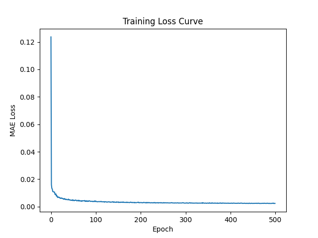
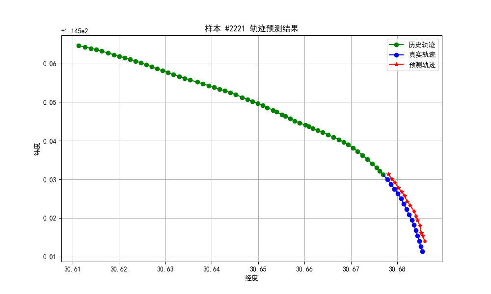
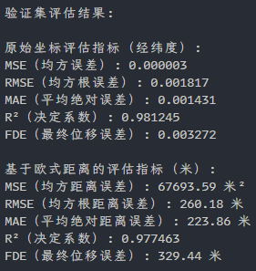
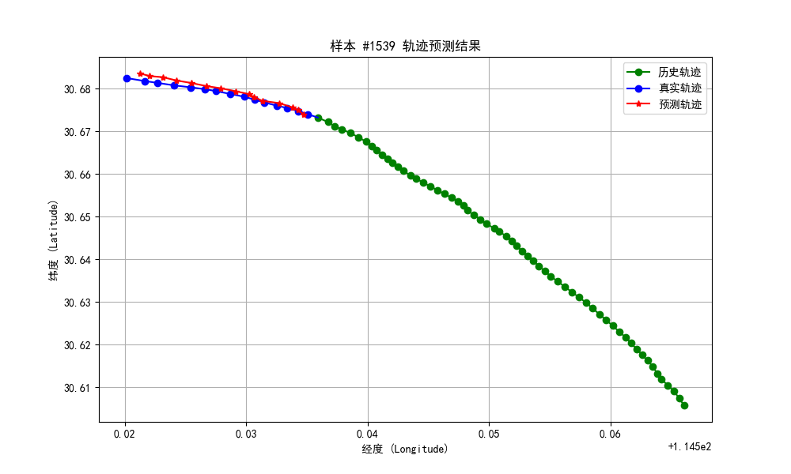
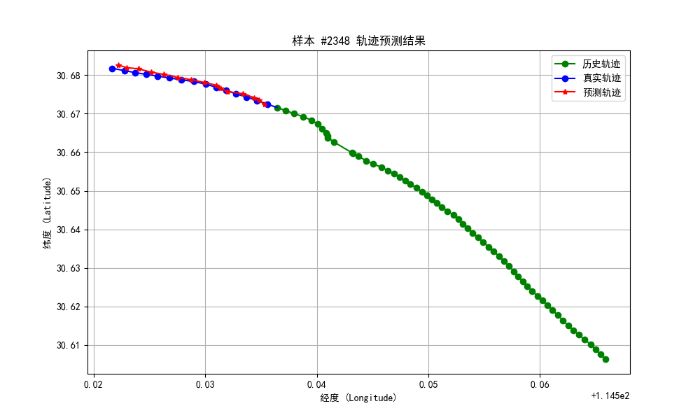
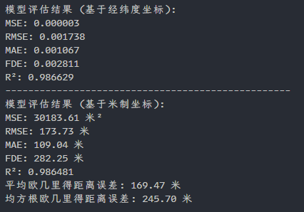

# 汇报

## 总表

## LSTM

模型训练的详细参数如下：

*   **优化器 (Optimizer)**: Adam
*   **损失函数 (Loss Function)**: L1Loss (平均绝对误差 MAE)
*   **学习率 (Learning Rate)**: 0.001
*   **训练轮次 (Epochs)**: 500
*   **批量大小 (Batch Size)**: 32
*   **LSTM 输入特征数 (Input Size)**: 2 (Lat, Lon)
*   **LSTM 输入步长 (Input Steps)**: 60 (使用过去60个时间步的Lat, Lon)
*   **LSTM 隐藏层大小 (Hidden Size)**: 64
*   **LSTM 输出步长 (Output Steps)**: 15 (预测未来15个时间步的Lat, Lon)

### 训练过程中的损失曲线如下：

### 预测结果

### 评估指标

## Bi-LSTM

模型训练的详细参数如下：

*   **优化器 (Optimizer)**: Adam (`torch.optim.Adam`)
*   **损失函数 (Loss Function)**: L1Loss (Mean Absolute Error, `nn.L1Loss()`)
*   **学习率 (Learning Rate)**: 0.001
*   **训练轮次 (Epochs)**: 500
*   **批量大小 (Batch Size)**: 32
*   **LSTM 输入特征数 (Input Size)**: 2 (对应 'Lat', 'Lon')
*   **LSTM 输入步长 (Input Steps)**: 60
*   **LSTM 隐藏层大小 (Hidden Size)**: 64
*   **LSTM 输出步长 (Output Steps)**: 15
*   **Dropout**: 0.0 (因为 `num_layers` 默认为1，所以 `lstm_dropout` 为0.0)

### 训练过程中的损失曲线如下：

### 预测结果

### 评估指标

## TimesNet

以下是 train.py 脚本中模型训练的主要参数：

**模型架构 (TimesNetPredictor):**
*   `seq_len`: 输入序列长度，设置为 `60`。
*   `pred_len`: 预测序列长度，设置为 `15`。
*   `input_size`: 输入特征维度，设置为 `2` (Lat, Lon)。
*   `d_model`: 模型内部的隐藏层维度，设置为 `128`。
*   `d_ff`: TimesBlock内部前馈网络的维度，设置为 `256`。
*   `top_k`: FFT选择的周期数量，设置为 `3`。
*   `num_kernels`: Inception模块中的卷积核数量，设置为 `8`。
*   `e_layers`: TimesBlock的层数（编码器层数），设置为 `3`。
*   `dropout`: Dropout比率，设置为 `0.1`。

**训练过程 (train_model):**
*   `epochs`: 训练轮数，设置为 `500`。
*   `lr` (learning_rate): 初始学习率，设置为 `0.0003`。
*   **损失函数 (CombinedLoss)**:
    *   `mse_weight`: MSE损失的权重，设置为 `0.3`。
    *   `mae_weight`: MAE损失的权重，设置为 `0.7`。
*   **优化器 (AdamW)**:
    *   `weight_decay`: 权重衰减，设置为 `1e-4`。
*   **学习率调度器 (ReduceLROnPlateau)**:
    *   `mode`: 'min' (当监控指标停止下降时降低学习率)。
    *   `factor`: 学习率降低的因子，设置为 `0.5`。
    *   `patience`: 学习率调度器的耐心轮数，设置为 `8`。
    *   `min_lr`: 学习率的下限，设置为 `1e-7`。
*   **早停机制 (EarlyStopping)**:
    *   `patience`: 早停的耐心轮数，设置为 `25`。
    *   `min_delta`: 认为损失没有改善的最小变化量，设置为 `1e-6`。
*   **梯度裁剪**:
    *   `max_norm`: 梯度的最大范数，设置为 `1.0`。

**数据加载:**
*   `batch_size`: 训练和验证数据加载器的批处理大小，设置为 `32`。
*   `num_workers`: 数据加载使用的工作进程数，设置为 `4`。

**数据增强 (augment_data):**
*   `noise_factor`: 添加高斯噪声的因子，设置为 `0.0005`。
*   `rotation_factor`: 微小旋转的角度因子，设置为 `0.05`。

