# 
 汇报

## 总表

## LSTM

模型训练的详细参数如下：

*   **优化器 (Optimizer)**: Adam
*   **损失函数 (Loss Function)**: L1Loss (平均绝对误差 MAE)
*   **学习率 (Learning Rate)**: 0.001
*   **训练轮次 (Epochs)**: 500
*   **批量大小 (Batch Size)**: 32
*   **LSTM 输入特征数 (Input Size)**: 2 (Lat, Lon)
*   **LSTM 输入步长 (Input Steps)**: 60 (使用过去60个时间步的Lat, Lon)
*   **LSTM 隐藏层大小 (Hidden Size)**: 64
*   **LSTM 输出步长 (Output Steps)**: 15 (预测未来15个时间步的Lat, Lon)

### 训练过程中的损失曲线如下：

### 预测结果

### 评估指标

## Bi-LSTM

模型训练的详细参数如下：

*   **优化器 (Optimizer)**: Adam (`torch.optim.Adam`)
*   **损失函数 (Loss Function)**: L1Loss (Mean Absolute Error, `nn.L1Loss()`)
*   **学习率 (Learning Rate)**: 0.001
*   **训练轮次 (Epochs)**: 500
*   **批量大小 (Batch Size)**: 32
*   **LSTM 输入特征数 (Input Size)**: 2 (对应 'Lat', 'Lon')
*   **LSTM 输入步长 (Input Steps)**: 60
*   **LSTM 隐藏层大小 (Hidden Size)**: 64
*   **LSTM 输出步长 (Output Steps)**: 15
*   **Dropout**: 0.0 (因为 `num_layers` 默认为1，所以 `lstm_dropout` 为0.0)

### 训练过程中的损失曲线如下：

### 预测结果

### 评估指标

## GRU

模型训练的详细参数如下：

*   **优化器 (Optimizer)**: Adam
*   **损失函数 (Loss Function)**: L1Loss (平均绝对误差 MAE)
*   **学习率 (Learning Rate)**: 0.001
*   **训练轮次 (Epochs)**: 500
*   **批量大小 (Batch Size)**: 32
*   **GRU 输入特征数 (Input Size)**: 2 (纬度和经度)
*   **GRU 输入步长 (Input Steps)**: 60 (代码中 `X = input_data[:60]`)
*   **GRU 隐藏层大小 (Hidden Size)**: 64
*   **GRU 输出步长 (Output Steps)**: 15
*   **dropout**: 代码中定义的 `GRUPredictor` 模型没有显式使用 dropout 层。

### 训练过程中的损失曲线如下：

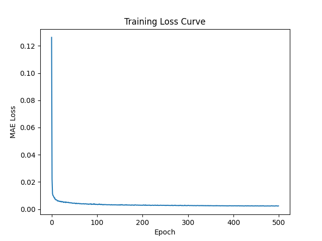

### 预测结果

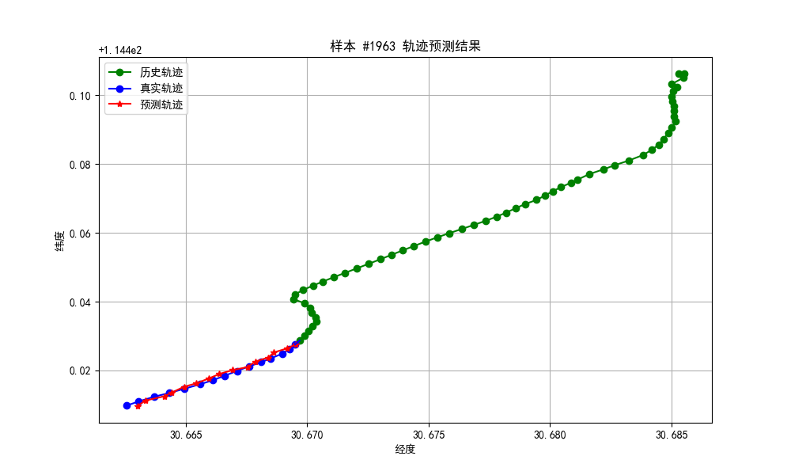

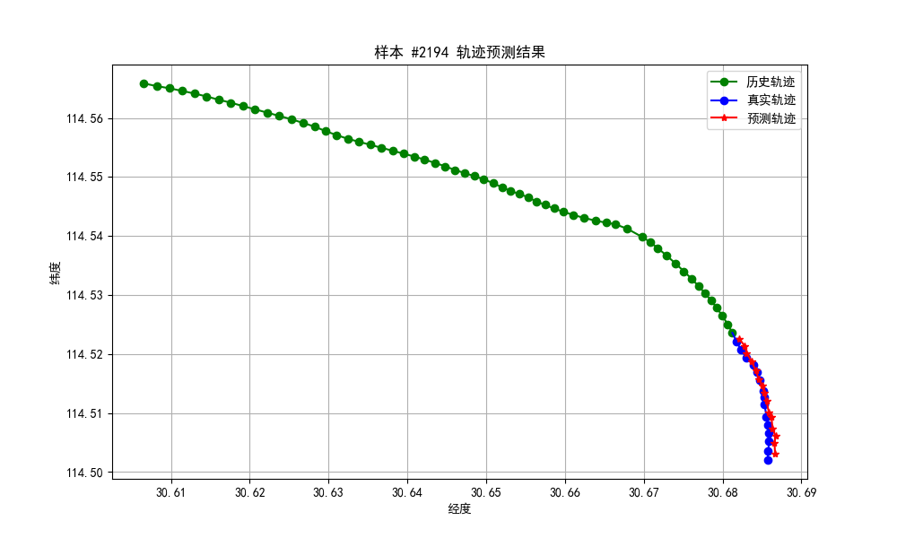

### 评估指标

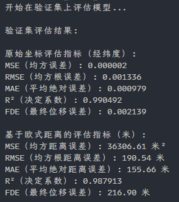

## Bi-GRU

模型训练的详细参数如下：

**模型架构 (`BiGRUPredictor`)**
*   `input_size`: `2` (输入特征维度，即经纬度)
*   `hidden_size`: `64` (GRU 隐藏层大小)
*   `output_steps`: `15` (预测未来时间步的数量)
*   `num_layers`: `1` (GRU 层数，使用默认值)
*   `dropout_prob`: `0.0` (Dropout 概率，使用默认值)

**训练超参数 (`train_model` 函数)**
*   `epochs`: `500` (训练轮数，使用默认值)
*   `learning_rate` (lr): `0.001` (学习率，使用默认值)
*   损失函数: `nn.L1Loss()` (平均绝对误差, MAE)
*   优化器: `torch.optim.Adam`

**数据加载器 (`DataLoader`)**
*   `batch_size`: `32` (每个批次的样本数)
*   `shuffle`: `True` (在每个 epoch 开始时打乱数据)

### 训练过程中的损失曲线如下：

### 预测结果

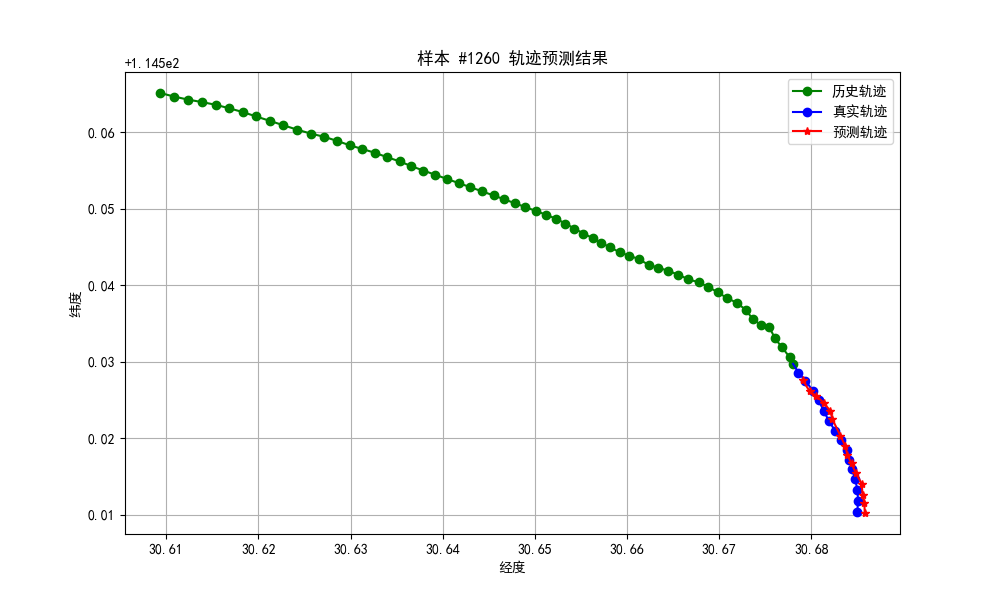

### 评估指标

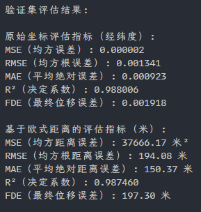

## Informer

以下是 `train.py` 脚本中模型训练的主要参数：

### 模型架构参数

这些参数在初始化 `InformerPredictor` 类时设置：

*   `enc_in`: 2 (编码器输入维度，即纬度和经度)
*   `dec_in`: 2 (解码器输入维度)
*   `c_out`: 2 (输出维度)
*   `seq_len`: 60 (输入序列长度)
*   `label_len`: 1 (标签长度)
*   `out_len`: 15 (预测序列长度)
*   `factor`: 3 (ProbSparse 注意力因子)
*   `d_model`: 512 (模型维度)
*   `n_heads`: 8 (注意力头数)
*   `e_layers`: 3 (编码器层数)
*   `d_layers`: 2 (解码器层数)
*   `d_ff`: 1024 (前馈网络维度)
*   `dropout`: 0.15 (Dropout 率)
*   `activation`: 'gelu' (激活函数)

### 训练超参数

这些参数在调用 `train_model` 函数时设置：

*   `epochs`: 500 (最大训练轮数)
*   `lr`: 0.0001 (学习率)
*   `patience`: 50 (早停的耐心轮数)
*   `min_delta`: 5e-5 (判断模型是否有改进的最小阈值)
*   `batch_size`: 32 (在 `DataLoader` 中设置)
*   **损失函数**: `nn.L1Loss()` (平均绝对误差, MAE Loss)
*   **优化器**: `torch.optim.Adam`

### 训练过程中的损失曲线如下：

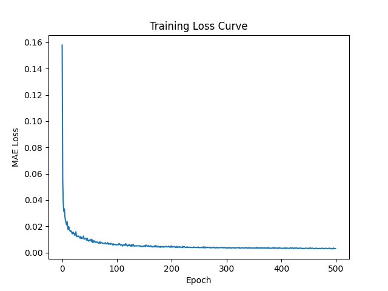

### 预测结果

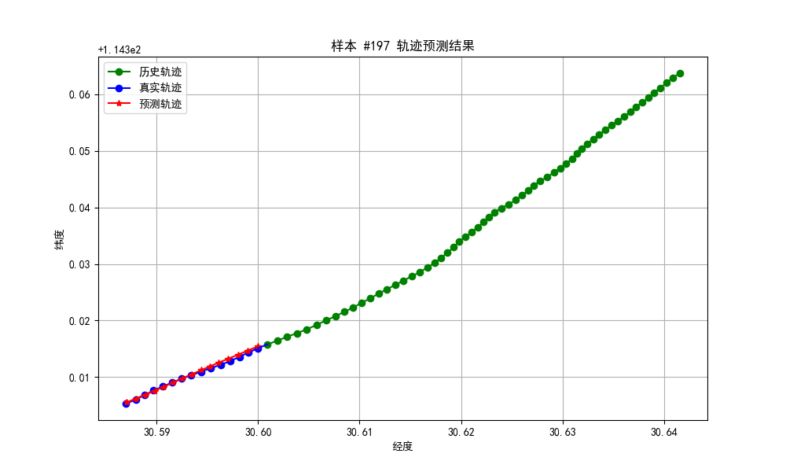

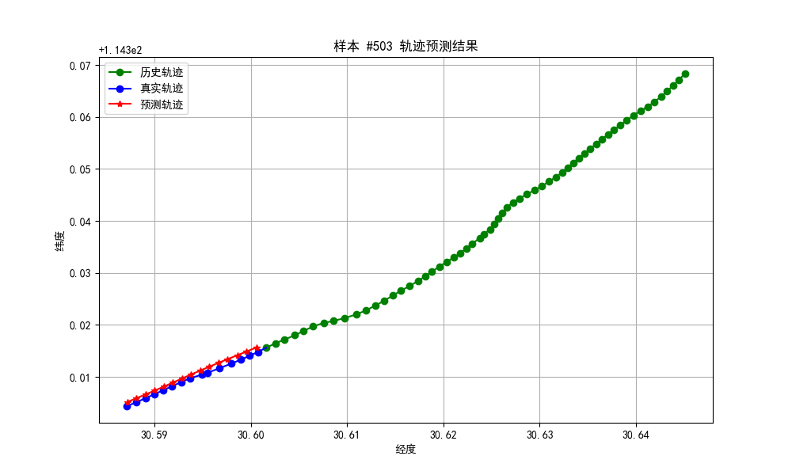

### 评估指标

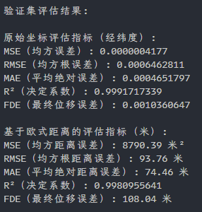

## TimesNet

以下是 train.py 脚本中模型训练的主要参数：

**模型架构 (TimesNetPredictor):**
*   `seq_len`: 输入序列长度，设置为 `60`。
*   `pred_len`: 预测序列长度，设置为 `15`。
*   `input_size`: 输入特征维度，设置为 `2` (Lat, Lon)。
*   `d_model`: 模型内部的隐藏层维度，设置为 `128`。
*   `d_ff`: TimesBlock内部前馈网络的维度，设置为 `256`。
*   `top_k`: FFT选择的周期数量，设置为 `3`。
*   `num_kernels`: Inception模块中的卷积核数量，设置为 `8`。
*   `e_layers`: TimesBlock的层数（编码器层数），设置为 `3`。
*   `dropout`: Dropout比率，设置为 `0.1`。

**训练过程 (train_model):**
*   `epochs`: 训练轮数，设置为 `500`。
*   `lr` (learning_rate): 初始学习率，设置为 `0.0003`。
*   **损失函数 (CombinedLoss)**:
    *   `mse_weight`: MSE损失的权重，设置为 `0.3`。
    *   `mae_weight`: MAE损失的权重，设置为 `0.7`。
*   **优化器 (AdamW)**:
    *   `weight_decay`: 权重衰减，设置为 `1e-4`。
*   **学习率调度器 (ReduceLROnPlateau)**:
    *   `mode`: 'min' (当监控指标停止下降时降低学习率)。
    *   `factor`: 学习率降低的因子，设置为 `0.5`。
    *   `patience`: 学习率调度器的耐心轮数，设置为 `8`。
    *   `min_lr`: 学习率的下限，设置为 `1e-7`。
*   **早停机制 (EarlyStopping)**:
    *   `patience`: 早停的耐心轮数，设置为 `25`。
    *   `min_delta`: 认为损失没有改善的最小变化量，设置为 `1e-6`。
*   **梯度裁剪**:
    *   `max_norm`: 梯度的最大范数，设置为 `1.0`。

**数据加载:**
*   `batch_size`: 训练和验证数据加载器的批处理大小，设置为 `32`。
*   `num_workers`: 数据加载使用的工作进程数，设置为 `4`。

**数据增强 (augment_data):**
*   `noise_factor`: 添加高斯噪声的因子，设置为 `0.0005`。
*   `rotation_factor`: 微小旋转的角度因子，设置为 `0.05`。

### 训练过程中的损失曲线如下：

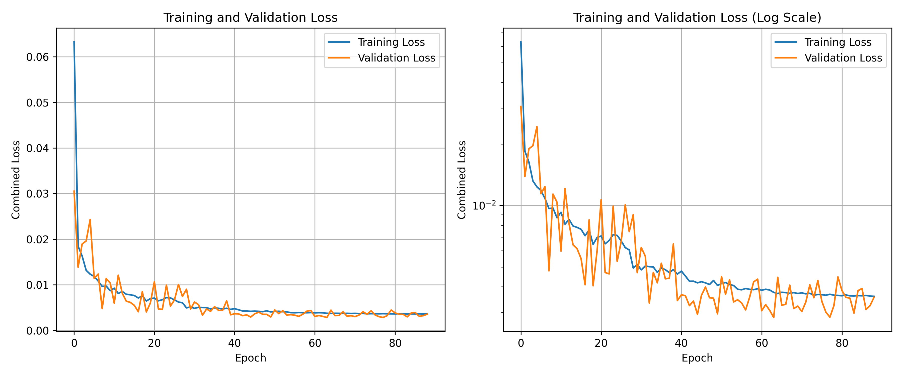

### 预测结果

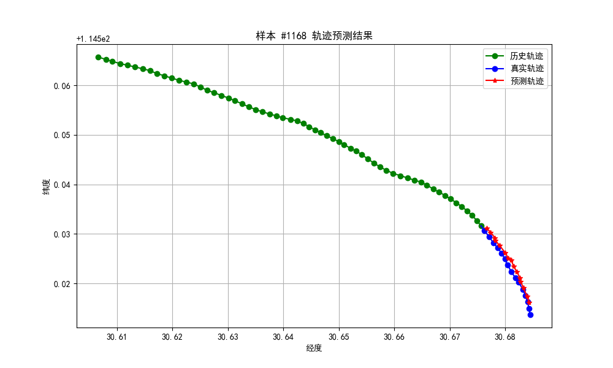

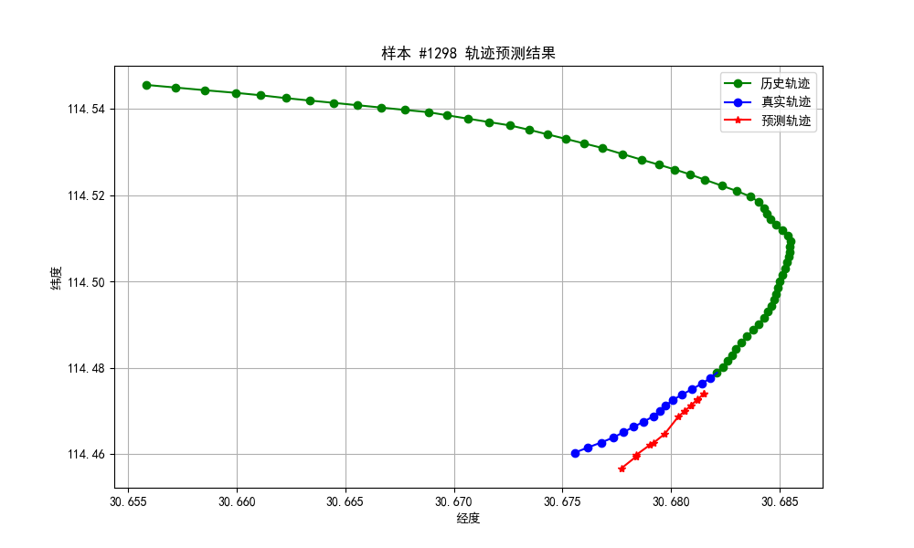

### 评估指标

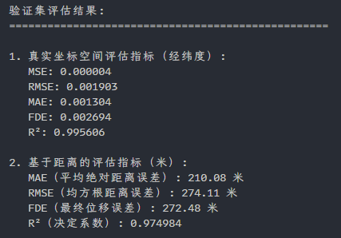

TimesNet模型的训练中，使用了早停机制，在验证集上监控MAE指标，当连续25个epoch没有改善时停止训练。最终训练轮次仅使用了89轮。

